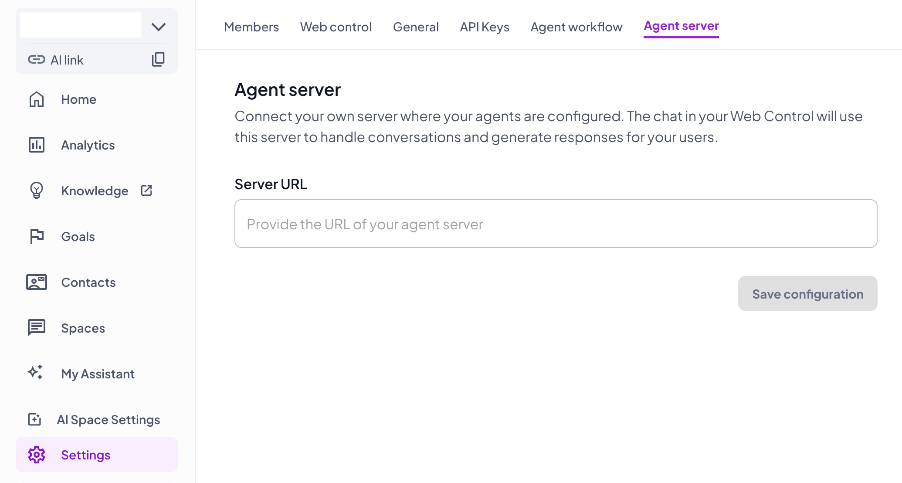
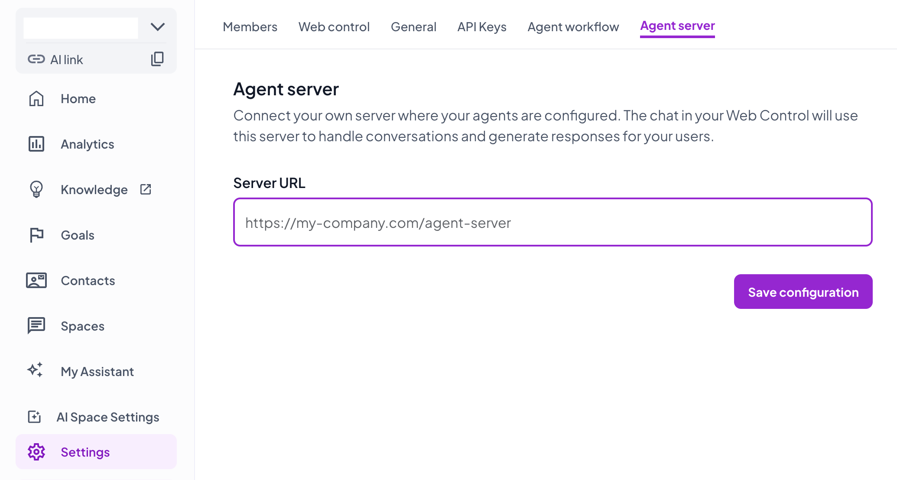
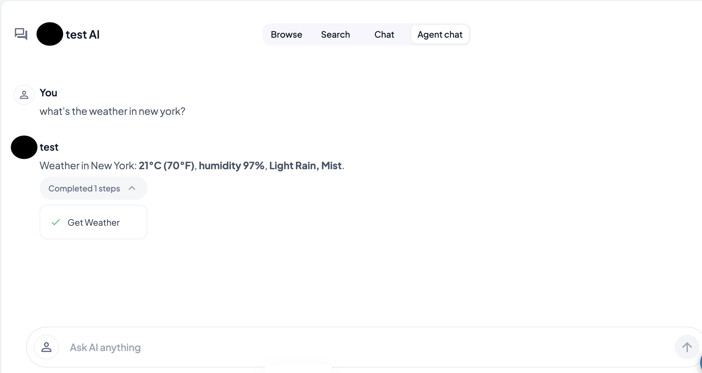

# live-demo-temporal-ai-sdk

A runnable Sharely agent server backed by a **Temporal workflow** that runs the
agent loop with the **[Temporal AI SDK integration](https://docs.temporal.io/develop/typescript/integrations/ai-sdk)**
(`@temporalio/ai-sdk` + the Vercel AI SDK).

This is the durable twin of [`live-demo-vercel`](../live-demo-vercel/) and a
contrast to its sibling [`live-demo-temporal`](../live-demo-temporal/): all three
share the same `createSharelyServer` front door and the same `get_weather` tool,
but they differ in **where the agent loop runs**.

| Demo                       | Agent loop runs in…                                  | LLM call durability                              |
| -------------------------- | ---------------------------------------------------- | ------------------------------------------------ |
| `live-demo-vercel`         | one process, inline `streamText`                     | not durable (in-memory)                          |
| `live-demo-temporal`       | one hand-rolled `fetch` loop inside a single activity | the whole turn is one durable activity           |
| **`live-demo-temporal-ai-sdk`** | **the workflow itself, via `generateText`**     | **each model turn + each tool call is its own durable activity** |

## What's different about the AI SDK integration

In `live-demo-temporal`, the workflow is a thin relay — it `proxyActivities` a
single `runAgent` activity that hand-rolls a raw OpenAI `fetch` loop and returns
the whole `AgentEvent[]` at once.

Here, **the agent loop lives in the workflow**. We call the Vercel AI SDK's
`generateText` directly inside `workflow.ts`, with the model resolved through
`temporalProvider.languageModel(MODEL)`. The `AiSdkPlugin` registered on the
worker transparently turns every LLM call into a Temporal activity — so you get
the ergonomic Vercel AI SDK developer experience (`generateText`, `tool()`,
zod schemas, multi-step tool calling via `stopWhen`) **and** Temporal's durable
execution, automatic retries, and crash recovery, without hand-writing a single
`fetch`. Tools are ordinary `proxyActivities`, so each tool call is durable too.

The workflow still drives the same Sharely wiring as its sibling: it exposes the
adapter's `AGENT_EVENTS_QUERY` sink, translates the `generateText` result into
`AgentEvent`s, and the server polls + streams them as SSE.

## How it's split (two processes)

| Process    | File                                 | Role                                                                                                                                                |
| ---------- | ------------------------------------ | --------------------------------------------------------------------------------------------------------------------------------------------------- |
| **Server** | [`server.ts`](src/server.ts)         | The Sharely agent server. `createSharelyServer` + `createTemporalHandler` (over `fromTemporal`). Starts a workflow per chat turn, polls its event-buffer query, streams events back as SSE. |
|            | [`handler.ts`](src/handler.ts)       | `createTemporalHandler` + `wrapTemporalClient` — adapts the real `@temporalio/client` `Client` to the adapter's structural shape.                    |
| **Worker** | [`worker.ts`](src/worker.ts)         | Registers the workflow + the `get_weather` activity, **and the `AiSdkPlugin`** (`modelProvider: openai`). Polls the task queue.                      |
|            | [`workflow.ts`](src/workflow.ts)     | Deterministic workflow. Runs `generateText` with `temporalProvider.languageModel(...)`, translates the result into `AgentEvent`s, relays them into the adapter's sink. |
|            | [`activities.ts`](src/activities.ts) | Just the `get_weather` tool activity. The LLM activities are injected by the plugin.                                                                 |

### Request flow

```
sharelyai-be ──▶ server.ts (createSharelyServer)
                    │  fromTemporal: client.start(sharelyAiSdkAgentWorkflow)
                    ▼
              Temporal server ──▶ worker.ts (+ AiSdkPlugin) ──▶ workflow.ts
                    │                                              │ generateText(temporalProvider.languageModel)
                    │                                              ├─▶ LLM call        → durable activity (plugin)
                    │                                              └─▶ get_weather     → durable activity (proxyActivities)
                    │              translate result → AgentEvent[] ─┘  into createAgentEventSink()
                    ▼
              server polls AGENT_EVENTS_QUERY until message_end → SSE → sharelyai-be
```

## Run it

You need a Temporal server, a worker, and the agent server — three terminals.

```bash
# 0. install + build (from repo root)
npm install
npx turbo run build

# 1. Temporal dev server (install the CLI: https://docs.temporal.io/cli)
temporal server start-dev          # serves :7233, UI on :8233

# 2. configure env
cd apps/live-demo-temporal-ai-sdk
cp .env.example .env               # fill in SHARELY_* and OPENAI_API_KEY

# 3. the worker (compiles, then runs under plain node — see note below)
npm run dev:worker

# 4. the agent server
npm run dev                        # listens on :8084
```

The server now listens on `http://localhost:8084`. The last step is to connect
your workspace to it — see [Configure it in your workspace](#configure-it-in-your-workspace)
below — then ask *"what's the weather in Berlin?"* to exercise the tool loop.

For production, `npm run build` once, then `npm start` (server) and
`npm run start:worker` (worker).

## Configure it in your workspace

With the server (and worker) running and reachable over HTTPS, point your Sharely
workspace at it. The chat in your **WebControl** then routes every conversation to
this server.

**1. Open Settings → Agent server.** In your workspace, go to **Settings** in the
left sidebar and open the **Agent server** tab.



**2. Add your server URL and save.** Paste your agent server's public URL into
**Server URL** and click **Save configuration**.



**3. Chat with your agent in WebControl.** Open **Agent chat** in your WebControl —
every message now goes to your server, and its replies, tool calls, and steps
stream back in live.



> **Reachability.** The URL must be reachable by Sharely over HTTPS. In production
> use your deployed URL (e.g. `https://my-company.com/agent-server`). For local
> development, expose your localhost with a tunnel — e.g. `ngrok http 8084` — and
> paste the resulting `https://…` URL.

> Runs alongside `live-demo-temporal` without collisions: this variant uses task
> queue `sharely-agents-ai-sdk`, workflow type `sharelyAiSdkAgentWorkflow`, and
> port `8084`.

## Design notes

- **The agent loop is in the workflow, the I/O is in activities.** Workflows are
  deterministic and can't do I/O. The AI SDK plugin resolves that by routing each
  `temporalProvider.languageModel(...)` call to an activity; `proxyActivities`
  does the same for tools. So `generateText` runs in the deterministic sandbox
  while every LLM/tool call is a durable, retryable activity. Crash mid-turn and
  Temporal replays the workflow and resumes from the last completed activity.

- **Model id lives in `workflow.ts`, not `.env`.** A workflow can't read
  `process.env` deterministically, so `MODEL` is a constant. The id is serialized
  to the plugin's LLM activity, where the worker's `modelProvider: openai` builds
  the real model (and reads `OPENAI_API_KEY`). To change models, edit the
  constant or thread it through `WorkflowInput`.

- **Turn-level batching, not token-level streaming.** This demo uses
  `generateText` (not `streamText`), so the workflow translates the *final*
  result into `AgentEvent`s and the next client poll drains them — the user sees
  the reply in one batch. The plugin's provider also supports `doStream`; wiring
  true mid-turn streaming back through the event sink is left as an extension.

- **First-party Sharely tools aren't available inside the workflow.** Same caveat
  as `live-demo-temporal`: the adapter passes only a *serializable* slice of
  `AgentContext` (workspaceId, threadId, userId, roleId, …) into the workflow —
  not `authorization` or the `api` client. So the platform tools
  (`semantic_search`, `search_knowledge`, …) can't dispatch here; this demo uses
  only the self-contained `get_weather` tool. To use platform tools you'd forward
  an auth token into the workflow input and rebuild an API client in an activity.

- **The worker runs under plain `node`, not `tsx`.** Temporal bundles the
  workflow with webpack, and `tsx`'s loader hook breaks webpack's module
  resolution. So `dev:worker` compiles with `tsc` first and runs `dist/worker.js`.
  The server side has no bundler and runs fine under `tsx` (`npm run dev`).

## Env vars

| Var                         | Used by       | Notes                                                  |
| --------------------------- | ------------- | ------------------------------------------------------ |
| `SHARELY_API_URL`           | server        | sharelyai-be base URL                                  |
| `SHARELY_WORKSPACE_ID`      | server        | your workspace id                                      |
| `SHARELY_WORKSPACE_API_KEY` | server        | workspace access-key token                             |
| `OPENAI_API_KEY`            | worker        | read by the AI SDK plugin's LLM activity               |
| `TEMPORAL_ADDRESS`          | server+worker | defaults to `localhost:7233`                           |
| `TEMPORAL_NAMESPACE`        | server+worker | defaults to `default`                                  |
| `TEMPORAL_TASK_QUEUE`       | server+worker | defaults to `sharely-agents-ai-sdk` (must match)       |
| `PORT`                      | server        | defaults to `8084`                                     |

The model id is **not** an env var — it's the `MODEL` constant in
[`src/workflow.ts`](src/workflow.ts).
